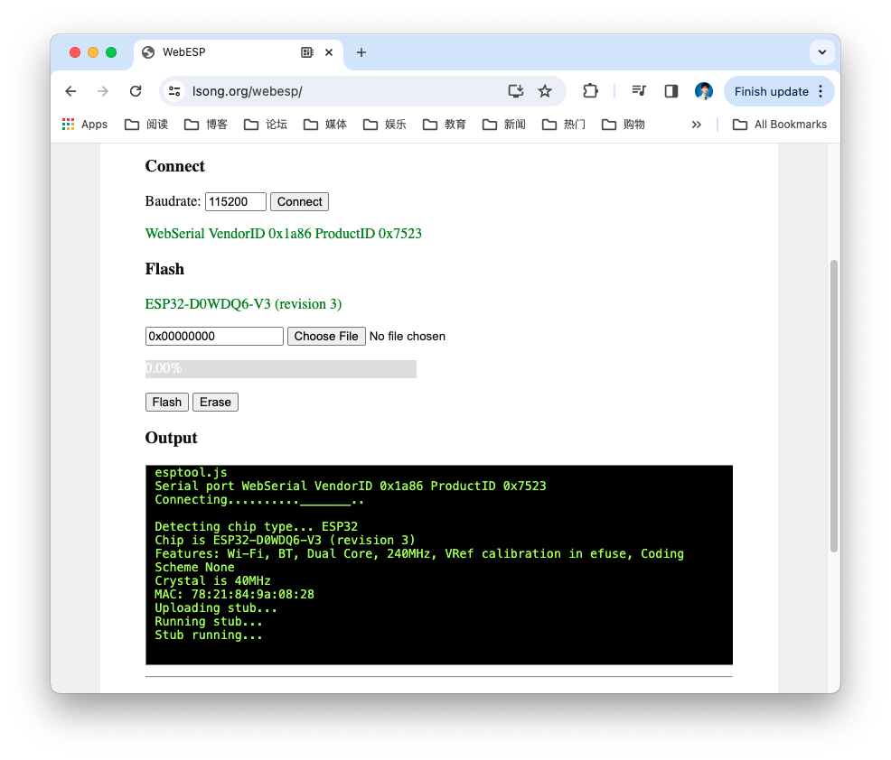

# WebESP
> 🌟 简洁明亮的 ESP32/ESP8266 网页版烧录工具

一个基于浏览器的ESP设备烧录工具，无需安装客户端，支持Web Serial API，界面清爽易用。



## 特性
- ✅ 明亮清爽的UI设计，响应式布局
- ✅ 支持ESP32/ESP8266全系列芯片
- ✅ 支持bin/elf/hex文件烧录
- ✅ 启用/禁用压缩、全片擦除选项
- ✅ 实时日志输出（颜色区分状态）
- ✅ 支持自定义波特率和Flash地址

## 使用方法
1. 打开浏览器（推荐Chrome/Firefox最新版）
2. 访问 [https://your-github-pages-url](https://your-github-pages-url)
3. 点击「连接设备」选择ESP设备
4. 添加要烧录的文件并设置Flash地址
5. 点击「开始烧录」等待完成

## 支持的浏览器
- Chrome ≥ 89
- Edge ≥ 89
- Firefox ≥ 99（需开启 `dom.serial.enabled` 配置）
- Safari ≥ 15.4

## 开发
```bash
# 克隆仓库
git clone https://github.com/your-username/WebESP.git
# 直接打开 index.html 即可开发